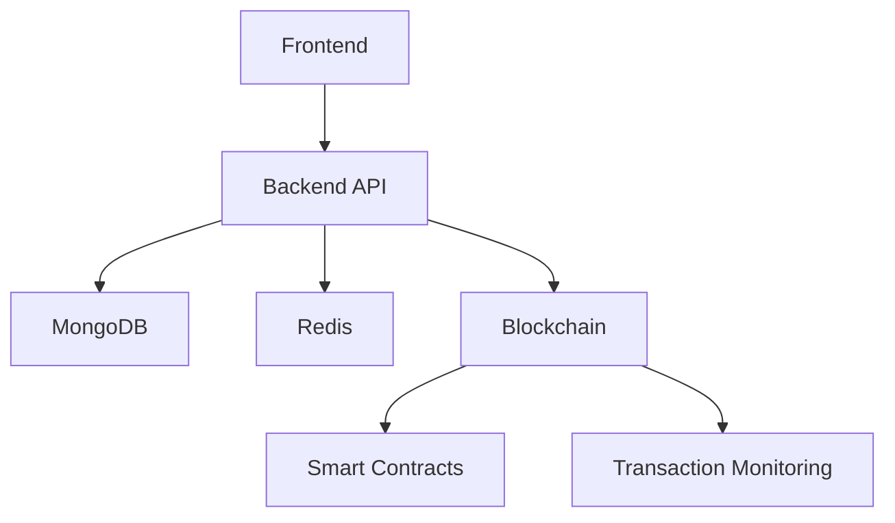

# SmartRent Developer Documentation

## System Architecture

### Overview
SmartRent is a blockchain-based property rental platform with the following key components:

1. **Frontend Application**
   - React-based web application
   - Web3 integration for blockchain interactions
   - Responsive design for all devices

2. **Backend API**
   - FastAPI-based REST API
   - JWT authentication
   - MongoDB for data storage
   - Redis for caching

3. **Blockchain Integration**
   - Ethereum smart contracts
   - Web3.py for contract interaction
   - Transaction monitoring service
   - Multi-network verification

4. **Database Layer**
   - MongoDB Atlas for document storage
   - Redis for caching and session management
   - Data migration tools

### Component Diagram


## Development Setup

### Prerequisites
- Python 3.9+
- Node.js 16+
- MongoDB 4.4+
- Redis 6.0+
- Git

### Installation

1. **Clone the Repository**
```bash
git clone https://github.com/DITreneris/smart-rent.git
cd smart-rent
```

2. **Set Up Python Environment**
```bash
python -m venv venv
source venv/bin/activate  # On Windows: venv\Scripts\activate
pip install -r requirements.txt
```

3. **Set Up Node.js Environment**
```bash
cd frontend
npm install
```

4. **Configure Environment Variables**
```bash
cp .env.example .env
# Edit .env with your configuration
```

### Database Setup

1. **MongoDB**
```bash
# Start MongoDB service
mongod --dbpath /path/to/data

# Create indexes
python scripts/create_indexes.py
```

2. **Redis**
```bash
# Start Redis server
redis-server
```

### Running the Application

1. **Start Backend**
```bash
uvicorn app.main:app --reload
```

2. **Start Frontend**
```bash
cd frontend
npm run dev
```

## API Design Principles

### RESTful Design
- Use HTTP methods appropriately
- Follow resource naming conventions
- Implement proper status codes
- Use consistent response formats

### Authentication
- JWT-based authentication
- Role-based access control
- Token refresh mechanism
- Secure password handling

### Error Handling
- Consistent error response format
- Proper HTTP status codes
- Detailed error messages
- Logging and monitoring

## Testing Framework

### Unit Tests
```python
# Example test
def test_create_property():
    property_data = {
        "title": "Test Property",
        "price": 1000
    }
    response = client.post("/api/properties", json=property_data)
    assert response.status_code == 201
    assert response.json()["title"] == "Test Property"
```

### Integration Tests
```python
# Example integration test
async def test_property_workflow():
    # Create property
    property = await create_test_property()
    
    # List properties
    properties = await list_properties()
    assert property in properties
    
    # Update property
    await update_property(property.id, {"price": 1200})
    
    # Verify update
    updated = await get_property(property.id)
    assert updated.price == 1200
```

### End-to-End Tests
```javascript
// Example E2E test
describe('Property Management', () => {
    it('should create and list properties', async () => {
        await page.goto('/properties');
        await page.click('[data-testid="create-property"]');
        await page.fill('[name="title"]', 'Test Property');
        await page.fill('[name="price"]', '1000');
        await page.click('[type="submit"]');
        
        await expect(page).toHaveText('Test Property');
    });
});
```

## Deployment

### Backend Deployment
1. Build Docker image
2. Push to container registry
3. Deploy to Kubernetes cluster
4. Configure environment variables
5. Set up monitoring

### Frontend Deployment
1. Build production bundle
2. Deploy to CDN
3. Configure environment variables
4. Set up monitoring

### Database Deployment
1. Set up MongoDB Atlas
2. Configure backups
3. Set up monitoring
4. Configure access controls

## Security Considerations

### Authentication
- Implement proper password hashing
- Use secure JWT configuration
- Implement rate limiting
- Set up proper CORS policies

### Data Protection
- Encrypt sensitive data
- Implement proper access controls
- Set up audit logging
- Regular security audits

### Blockchain Security
- Secure private key handling
- Implement proper contract access controls
- Monitor for suspicious activity
- Regular security audits

## Monitoring and Logging

### Application Monitoring
- Set up Prometheus metrics
- Configure Grafana dashboards
- Implement health checks
- Monitor performance metrics

### Logging
- Structured logging format
- Log aggregation
- Error tracking
- Performance monitoring

## Contributing

### Code Style
- Follow PEP 8 for Python
- Use ESLint for JavaScript
- Document all public APIs
- Write unit tests for new features

### Pull Request Process
1. Create feature branch
2. Write tests
3. Update documentation
4. Submit pull request
5. Address review comments
6. Merge after approval

### Documentation
- Update README files
- Document API changes
- Update architecture diagrams
- Add code examples

## Troubleshooting

### Common Issues
1. Database connection issues
2. Authentication problems
3. Blockchain transaction failures
4. Performance issues

### Debugging Tools
- Logging configuration
- Debug endpoints
- Monitoring dashboards
- Performance profiling

## Support

For developer support:
- GitHub Issues
- Developer Documentation
- Community Forum
- Technical Support 