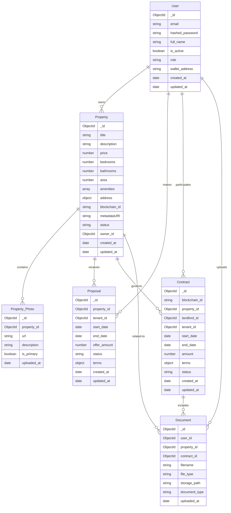

# Database Schema Documentation

This document provides a comprehensive overview of the SmartRent database schema, including collections, relationships, and data types.

## Overview

SmartRent uses MongoDB as its primary database, with both synchronous and asynchronous drivers for different use cases. The database schema is designed to support the core functionality of the platform, including property management, user accounts, and blockchain integration.

## Database Connection

The database connection is established through MongoDB drivers in `app/core/mongo_db.py`:

```python
import motor.motor_asyncio
from pymongo import MongoClient
from pymongo.server_api import ServerApi
from typing import Dict, Any, List, Optional
from bson import ObjectId
from datetime import datetime
from pymongo.errors import ConnectionFailure, ServerSelectionTimeoutError
import logging

from app.core.config import settings

# Connection options
connection_options = {
    "serverSelectionTimeoutMS": 5000,    # 5 seconds for server selection
    "connectTimeoutMS": 10000,           # 10 seconds to establish a connection
    "socketTimeoutMS": 30000,            # 30 seconds for socket operations
    "maxPoolSize": 100,                  # Maximum connection pool size
    "minPoolSize": 10,                   # Minimum connection pool size
    "maxIdleTimeMS": 45000,              # Max time a connection can be idle (45 sec)
    "retryWrites": True,                 # Retry write operations
    "w": "majority"                      # Write concern
}

# Create MongoDB connection string from settings
MONGO_CONNECTION_STRING = settings.MONGO_CONNECTION_STRING

# MongoDB async client (for FastAPI)
async_client = motor.motor_asyncio.AsyncIOMotorClient(
    MONGO_CONNECTION_STRING, 
    server_api=ServerApi('1'),
    **connection_options
)
db = async_client[settings.MONGO_DB_NAME]

# MongoDB sync client (for migrations and scripts)
sync_client = MongoClient(
    MONGO_CONNECTION_STRING, 
    server_api=ServerApi('1'),
    **connection_options
)
sync_db = sync_client[settings.MONGO_DB_NAME]
```

## Data Model Diagram

Below is a simplified entity relationship diagram showing the main collections and their relationships:



## Collections

### Users Collection

The `users` collection stores information about users in the system, including landlords, tenants, and administrators.

**Collection Name:** users

| Field Name | Data Type | Description |
|------------|-----------|-------------|
| _id | ObjectId | Unique identifier for the user |
| email | String | User's email address (unique, indexed) |
| hashed_password | String | Bcrypt-hashed password |
| full_name | String | User's full name |
| is_active | Boolean | Whether the user account is active (default: true) |
| role | String | User role: 'landlord', 'tenant', or 'admin' (default: 'tenant') |
| wallet_address | String | Blockchain wallet address (unique, sparse indexed) |
| created_at | Date | Timestamp when the user was created |
| updated_at | Date | Timestamp when the user was last updated |

### Properties Collection

The `properties` collection stores information about real estate properties available for rent on the platform.

**Collection Name:** properties

| Field Name | Data Type | Description |
|------------|-----------|-------------|
| _id | ObjectId | Unique identifier for the property |
| title | String | Property title |
| description | String | Detailed description of the property |
| price | Number | Rental price |
| bedrooms | Number | Number of bedrooms (default: 1) |
| bathrooms | Number | Number of bathrooms (default: 1) |
| area | Number | Property area in square meters/feet |
| amenities | Array | List of property amenities |
| address | Object | Property address with components (street, city, state, etc.) |
| blockchain_id | String | ID of the property on the blockchain (unique, sparse indexed) |
| metadataURI | String | URI to property metadata on IPFS or similar storage |
| status | String | Property status: 'available', 'rented', or 'pending' (default: 'available') |
| owner_id | ObjectId | Reference to the user who owns the property |
| created_at | Date | Timestamp when the property was created |
| updated_at | Date | Timestamp when the property was last updated |

### Property Photos Collection

The `property_photos` collection stores photos related to properties.

**Collection Name:** property_photos

| Field Name | Data Type | Description |
|------------|-----------|-------------|
| _id | ObjectId | Unique identifier for the photo |
| property_id | ObjectId | Reference to the property (indexed) |
| url | String | URL to the photo |
| description | String | Optional description of the photo |
| is_primary | Boolean | Whether this is the primary property photo |
| uploaded_at | Date | Timestamp when the photo was uploaded |

### Proposals Collection

The `proposals` collection stores rental proposals from tenants to landlords.

**Collection Name:** proposals

| Field Name | Data Type | Description |
|------------|-----------|-------------|
| _id | ObjectId | Unique identifier for the proposal |
| property_id | ObjectId | Reference to the property (indexed) |
| tenant_id | ObjectId | Reference to the tenant user (indexed) |
| start_date | Date | Proposed lease start date |
| end_date | Date | Proposed lease end date |
| offer_amount | Number | Proposed rental amount |
| status | String | Proposal status: 'pending', 'accepted', 'rejected', 'expired' |
| terms | Object | Additional terms and conditions |
| created_at | Date | Timestamp when the proposal was created |
| updated_at | Date | Timestamp when the proposal was last updated |

### Contracts Collection

The `contracts` collection stores lease contracts between landlords and tenants.

**Collection Name:** contracts

| Field Name | Data Type | Description |
|------------|-----------|-------------|
| _id | ObjectId | Unique identifier for the contract |
| blockchain_id | String | ID of the contract on the blockchain (unique, sparse indexed) |
| property_id | ObjectId | Reference to the property (indexed) |
| landlord_id | ObjectId | Reference to the landlord user |
| tenant_id | ObjectId | Reference to the tenant user |
| start_date | Date | Lease start date |
| end_date | Date | Lease end date |
| amount | Number | Rental amount |
| terms | Object | Contract terms and conditions |
| status | String | Contract status: 'active', 'completed', 'terminated' |
| created_at | Date | Timestamp when the contract was created |
| updated_at | Date | Timestamp when the contract was last updated |

### Documents Collection

The `documents` collection stores documents related to users, properties, and contracts.

**Collection Name:** documents

| Field Name | Data Type | Description |
|------------|-----------|-------------|
| _id | ObjectId | Unique identifier for the document |
| user_id | ObjectId | Reference to the user who uploaded the document (indexed) |
| property_id | ObjectId | Optional reference to the related property (indexed, sparse) |
| contract_id | ObjectId | Optional reference to the related contract (indexed, sparse) |
| filename | String | Original filename |
| file_type | String | MIME type of the document |
| storage_path | String | Path to the stored document |
| document_type | String | Type of document (ID, lease, certificate, etc.) |
| uploaded_at | Date | Timestamp when the document was uploaded |

## Relationships

MongoDB is a document-oriented NoSQL database, so relationships are implemented differently than in relational databases. In SmartRent, relationships are maintained through:

1. **References**: Storing ObjectId references to related documents
2. **Indexes**: Creating indexes on reference fields for efficient querying

Key relationships include:

- A user can own multiple properties (tracked through `owner_id` in the properties collection)
- A property can have multiple photos (tracked through `property_id` in the property_photos collection)
- A property can receive multiple rental proposals (tracked through `property_id` in the proposals collection)
- A user can make multiple proposals (tracked through `tenant_id` in the proposals collection)
- A property can have multiple contracts over time (tracked through `property_id` in the contracts collection)

## Indexes

The following indexes are defined to optimize queries:

- `users.email`: Unique index on email field for quick user lookups
- `users.wallet_address`: Unique, sparse index for blockchain wallet addresses
- `properties.blockchain_id`: Unique, sparse index for blockchain property IDs
- `property_photos.property_id`: Index for quick lookup of a property's photos
- `proposals.property_id`: Index for finding proposals for a specific property
- `proposals.tenant_id`: Index for finding a tenant's proposals
- `contracts.property_id`: Index for finding contracts related to a property
- `contracts.blockchain_id`: Unique, sparse index for blockchain contract IDs
- `documents.user_id`: Index for finding a user's documents
- `documents.property_id`: Sparse index for finding property-related documents
- `documents.contract_id`: Sparse index for finding contract-related documents

## Data Types

MongoDB supports a variety of data types:

- **ObjectId**: Unique identifier for documents
- **String**: For text fields
- **Number**: For numeric fields (both integer and decimal)
- **Boolean**: For true/false values
- **Date**: For timestamps and dates
- **Array**: For lists of values (e.g., amenities)
- **Object**: For embedded documents (e.g., address)

## Custom Types

To handle MongoDB ObjectIds in our application, we use a custom type:

```python
class PyObjectId(ObjectId):
    """Custom ObjectId class for Pydantic models with MongoDB."""
    
    @classmethod
    def __get_validators__(cls):
        yield cls.validate
        
    @classmethod
    def validate(cls, v):
        if not ObjectId.is_valid(v):
            raise ValueError("Invalid ObjectId")
        return ObjectId(v)
    
    @classmethod
    def __modify_schema__(cls, field_schema):
        field_schema.update(type="string")
```

## Database Initialization

Database initialization, including collection and index creation, is handled in `app/db/init_mongodb.py`:

```python
# Create indexes for collections
# Property collection indexes
db.properties.create_index("blockchain_id", unique=True, sparse=True)

# User collection indexes
db.users.create_index("email", unique=True)
db.users.create_index("wallet_address", unique=True, sparse=True)

# Proposal collection indexes
db.proposals.create_index("property_id")
db.proposals.create_index("tenant_id")

# Contract collection indexes
db.contracts.create_index("blockchain_id", unique=True, sparse=True)
db.contracts.create_index("property_id")

# Photos collection indexes
db.property_photos.create_index("property_id")

# Document collection indexes
db.documents.create_index("user_id")
db.documents.create_index("property_id", sparse=True)
db.documents.create_index("contract_id", sparse=True)
```

## Best Practices for Schema Changes

When making changes to the MongoDB schema:

1. **Plan for Migration**: Document-oriented databases are schemaless, but you still need to plan for data migration when fields change
2. **Version Documents**: Consider adding a version field to documents to track schema changes
3. **Use Sparse Indexes**: For fields that may not exist in all documents
4. **Test with Large Datasets**: Ensure indexes and queries perform well with realistic data volumes
5. **Consider Embedding vs. Referencing**: Choose the right approach based on data access patterns
6. **Document All Changes**: Keep this schema documentation updated with all changes
7. **Use Transactions When Necessary**: For operations that need to be atomic across multiple collections 